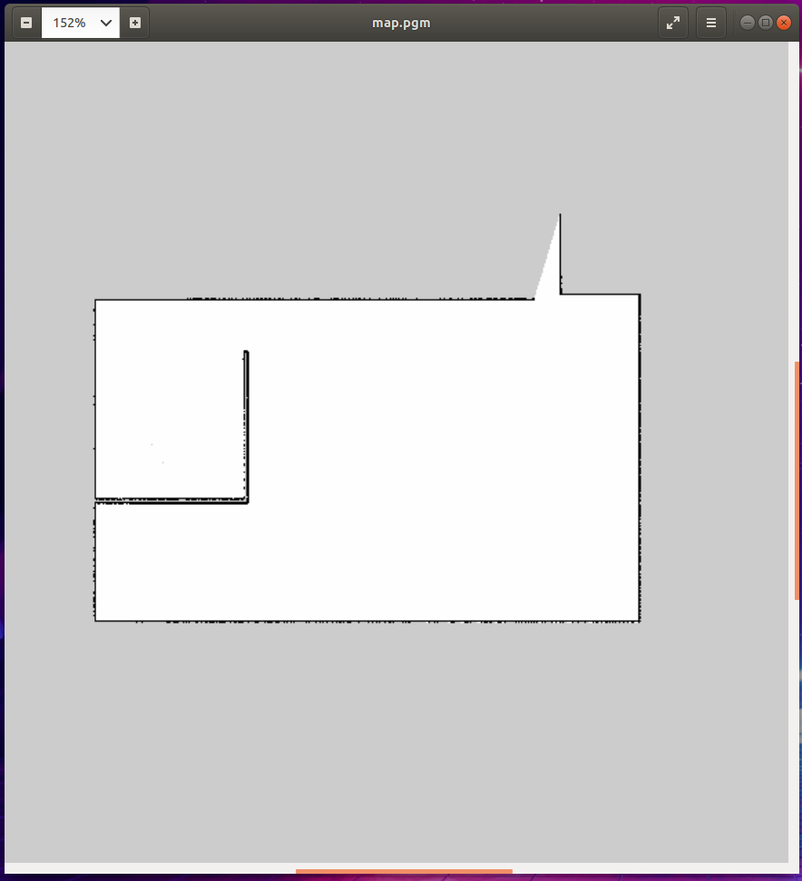
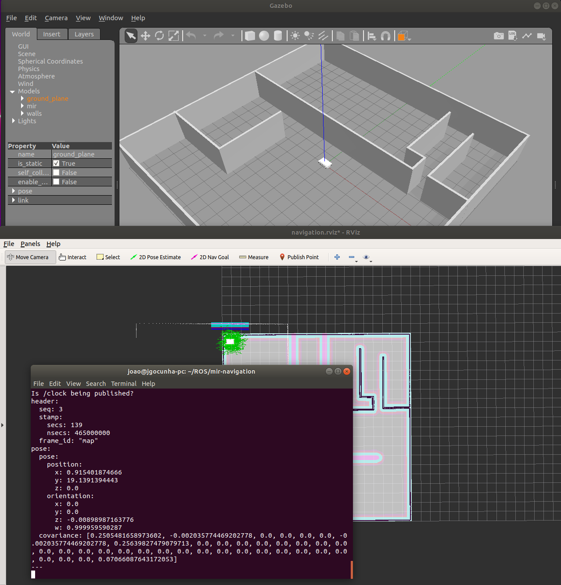

# mir-navigation

This repository concerns the development of an autonomous mobile base with the MiR 100 for the *Symbiotic Human-Robot Collaboration in Joint Manufacturing Tasks* project within the scope of *HIM – Human Interfacing & Mimicking in Cyber-Physical Systems.*

The repository holds ROS simulation packages for the MiR robot credited to the [DFKI, the German Research Center for Artificial Intelligence](https://github.com/dfki-ric/mir_robot), which built the base for our work.

The design and development of the Navigation Goals modules is of our responsibility. For more information, refer to the Wiki page.

All rights reserved.

## Running the main simulation program

To run the main simulation with Gazebo and Rviz just execute the following command:

```bash
roslaunch mir_gazebo mir_simulation.launch
```

This file will boot the Gazebo simulation and start it. Afterwards the localization and navigation nodes will launch, as well as an additional visual representation in Rviz.

From here you can use the 2D navigation tool in Rviz or the rqt command window that also appears to move the robot.


## Building a map in simulation

To build a map simply run the following command:

```bash
roslaunch mir_gazebo mir_mapping.launch
```

This will launch:
- the gazebo simulation, start it;
- mapping;
- move base;
- and the RViz visualisation.

On RViz make sure that under Global Options on the left hand side panel, checkthat Fixed Frame is set to /odom_combined. To see the map updates as you drive the robot around, under Map on the left hand side panel, check to see that Topic is set tomap.

Now move the robot around using the rqt_robot_steering window or using the Rviz 2D Navgoal. Once you have the complete 2D representation of the map in RViz save your map using:

```bash
rosrun map_server map_saver -f <map_dir\map_name>
```

The previous command will generate two files with the name you specified in the map_server command. 

The .yaml contains meta data about the map, including the location of image file of the map, its resolution, its origin, the occupied cells threshold, and the free cells threshold. Here are the details for the different parameters:
- **image**: has a pgm format which contains numeric values between 0 and 255. It represents the path to the image file containing the occupancy data; can be absolute, or relative to the location of the YAML file;
- **resolution**: it is the resolution of the map and is expressed in meters/pixel;
- **origin**: The 2-D pose of the lower-left pixel in the map, as (x, y, yaw), with yaw as counter clockwise rotation (yaw=0 means no rotation). Many parts of the system currently ignore yaw;
- **occupied_thresh**: Pixels with occupancy probability greater than this threshold are con-sidered completely occupied;
- **free_thresh**: Pixels with occupancy probability less than this threshold are considered completely free;
- **negate**: Whether the white/black free/occupied semantics should be reversed (interpretation of thresholds is unaffected).

```yaml
image: maze.png
resolution: 0.05
origin: [0.0, 0.0, 0.0]
negate: 0
occupied_thresh: 0.65
free_thresh: 0.196
```

Now, for the second file, that is the .pgm image file, it is just a gray-scale image of the map which you can open using any image editor program.

[

## Finding the coordinates of locations of interest

The easiest way to use Rviz to visualize the map and then getting the coordinate using the 2D Pose Estimate button. Let us start the main simulation with:

```bash
roslaunch mir_gazebo mir_simulation.launch
```

Now, you want to find the coordinate of any location of interest. Open another terminal and write:

```bash
rostopic echo /amcl_pose
```

This command will display any new /amcl_pose, which is the ROS topic represents the location of the robot on the map. Now, click on 2D Pose Estimate button, then click on any location ofinterest on the map. Go back to the terminal where wrote rostopic echo /amcl_pose, and you will find the coordinate of the point select as in the following figure:

[

## Simple navigation goals with code

### ROS setup

In order to create a ROS node that sends goals to the navigation stack, the first thing we'll need to do is create a package. To do this we'll use the handy command where we want to create the package directory with a dependency on the move_base_msgs, actionlib, and roscpp packages as shown below:

```bash
catkin_create_pkg simple_navigation_goals move_base_msgs actionlib roscpp
```

Then build and source. If this was succesfull you will be able to access your package with:

```bash
roscd simple_navigation_goals
```

### Creating the node

Now that we have our package, we need to write the code that will send goals to the base. Fire up a text editor and paste the following into a file called src/simple_navigation_goals.cpp. 

```C++
#include <ros/ros.h>
#include <move_base_msgs/MoveBaseAction.h>
#include <actionlib/client/simple_action_client.h>

typedef actionlib::SimpleActionClient<move_base_msgs::MoveBaseAction> MoveBaseClient;

int main(int argc, char** argv){
  ros::init(argc, argv, "simple_navigation_goals");

  //tell the action client that we want to spin a thread by default
  MoveBaseClient ac("move_base", true);

  //wait for the action server to come up
  while(!ac.waitForServer(ros::Duration(5.0))){
    ROS_INFO("Waiting for the move_base action server to come up");
  }

  move_base_msgs::MoveBaseGoal goal;

  //we'll send a goal to the robot to move 1 meter forward
  goal.target_pose.header.frame_id = "base_link";
  goal.target_pose.header.stamp = ros::Time::now();

  goal.target_pose.pose.position.x = 1.0;
  goal.target_pose.pose.orientation.w = 1.0;

  ROS_INFO("Sending goal");
  ac.sendGoal(goal);

  ac.waitForResult();

  if(ac.getState() == actionlib::SimpleClientGoalState::SUCCEEDED)
    ROS_INFO("Hooray, the base moved 1 meter forward");
  else
    ROS_INFO("The base failed to move forward 1 meter for some reason");

  return 0;
```

```C++
#include <move_base_msgs/MoveBaseAction.h>
```

This line includes the action specification for move\_base which is a ROS action that exposes a high level interface to the navigation stack. Essentially, the move\_base action accepts goals from clients and attempts to move the robot to the specified position/orientation in the world.

```C++
typedef actionlib::SimpleActionClient<move_base_msgs::MoveBaseAction> MoveBaseClient;
```


This line creates a convenience typedef for a SimpleActionClient that will allow us to communicate with actions that adhere to the MoveBaseAction action interface.

```C++
//tell the action client that we want to spin a thread by default
MoveBaseClient ac("move_base", true);
```

This line constructs an action client that we'll use to communicate with the action named "move_base" that adheres to the MoveBaseAction interface. It also tells the action client to start a thread to call ros::spin() so that ROS callbacks will be processed by passing "true" as the second argument of the MoveBaseClient constructor.

```C++
//wait for the action server to come up
while(!ac.waitForServer(ros::Duration(5.0))){
ROS_INFO("Waiting for the move_base action server to come up");
}
```

These lines wait for the action server to report that it has come up and is ready to begin processing goals.

```C++
move_base_msgs::MoveBaseGoal goal;

//we'll send a goal to the robot to move 1 meter forward
goal.target_pose.header.frame_id = "base_link";
goal.target_pose.header.stamp = ros::Time::now();

goal.target_pose.pose.position.x = 1.0;
goal.target_pose.pose.orientation.w = 1.0;

ROS_INFO("Sending goal");
ac.sendGoal(goal);
```

Here we create a goal to send to move_base using the move_base_msgs::MoveBaseGoal message type which is included automatically with the MoveBaseAction.h header. We'll just tell the base to move 1 meter forward in the "base_link" coordinate frame. The call to ac.sendGoal will actually push the goal out over the wire to the move_base node for processing.

```C++
ac.waitForResult();

if(ac.getState() == actionlib::SimpleClientGoalState::SUCCEEDED)
ROS_INFO("Hooray, the base moved 1 meter forward");
else
ROS_INFO("The base failed to move forward 1 meter for some reason");
```

The only thing left to do now is to wait for the goal to finish using the ac.waitForGoalToFinish call which will block until the move_base action is done processing the goal we sent it. After it finishes, we can check if the goal succeeded or failed and output a message to the user accordingly.

### Building and running

Now that we have a package and a source file, we'll want to build and then try things out. The first step will be to add our src/simple_navigation_goals.cpp file to our CMakeLists.txt file to get it to build. Open up CMakeLists.txt in your editor of choice and add the following line to the bottom of the file.

```cmake
add_executable(simple_navigation_goals src/simple_navigation_goals.cpp)
target_link_libraries(simple_navigation_goals ${catkin_LIBRARIES})
```

Once this is done, we can build our executable by typing make.

Now we're ready to run. At this point, we'll assume that the navigation stack has been brought up according to one of the tutorials listed above. One important thing to check is that the name of the action, we've assumed "move_base" in this tutorial, matches the name used in your code. To check this, we'll execute the following rostopic command:

```bash
rostopic list | grep move_base/goal
```

If something shows up, then you're good to go. Otherwise, you need to find the name of the action that the navigation stack is using, a common alternative on the PR2 platform is "move_base_local," and update all references in the src/simple_navigation_goals.cpp file accordingly.

After this, its as simple as running the executable we created.

```bash
rosrun simple_navigation_goals simple_navigation_goals
```

And, if all goes well, the robot should begin to move a meter forward.


For all these tutorials you can find a video explanation on the multimedia/videos folder.